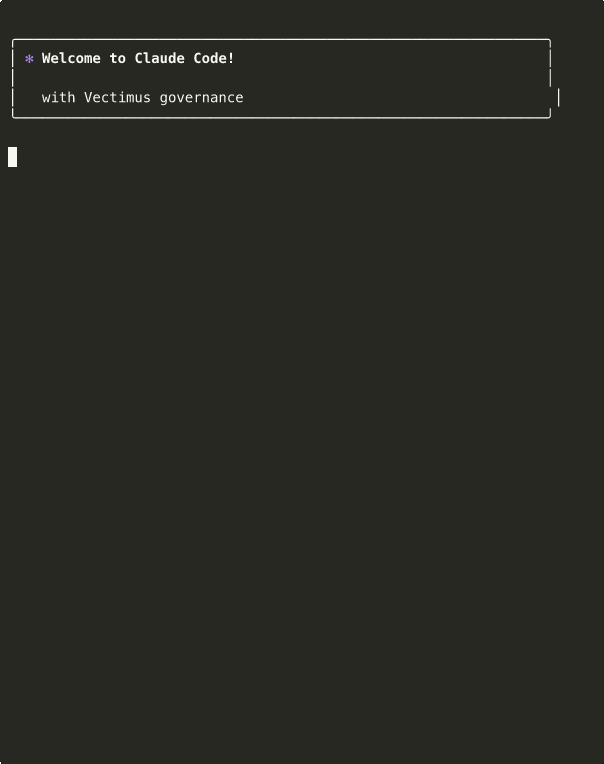

# Vectimus

**Cedar policies for every AI agent action. Coding tools and agentic frameworks. Every evaluation under 10ms. Zero config.**

[](https://pypi.org/project/vectimus/)
[](LICENSE)
[](https://github.com/vectimus/vectimus/actions)
[](https://pypi.org/project/vectimus/)

<p align="center">
  
</p>

## Install

```bash
pipx install vectimus
vectimus init
```

That's it.  Cedar policies evaluate every tool call - whether from a coding agent in your terminal or a framework agent in production.  Dangerous commands, secret access, infrastructure changes and supply chain attacks blocked before execution.

## What it catches

Every policy references the real-world incident that motivated it.  No "best practice" filler.

| Pack | What it blocks | Example |
|------|---------------|---------|
| **Destructive Ops** | `rm -rf`, `terraform destroy`, `docker system prune` | Production wipe prevention |
| **Secrets** | Credential file access, env variable exposure | `.env`, AWS keys, SSH keys |
| **Supply Chain** | `npm publish`, `pip install` from URLs, registry tampering | Clinejection-class attacks |
| **Infrastructure** | `terraform apply`, `kubectl delete`, cloud CLI mutations | Unreviewed infra changes |
| **Code Execution** | `eval()`, `exec()`, unsafe interpreter invocations | Code injection via agents |
| **Data Exfiltration** | `curl` to external hosts, file upload, data piping | Credential theft, data leakage |
| **File Integrity** | Writes to `.vectimus/`, sensitive config paths | Governance tampering |
| **Database** | Direct database CLI access, credential harvesting | Unauthorized data access |
| **Git Safety** | `git push --force`, history rewriting, credential commits | Repository damage |
| **MCP Safety** | Unapproved MCP servers, dangerous tool parameters | MCP server supply chain |
| **Agent Governance** | Unchecked agent spawning, goal hijacking, rogue agents | Multi-agent control |

11 packs.  [Browse all policies →](https://vectimus.com/policies)

Maps to [OWASP Agentic Top 10](https://genai.owasp.org/resource/owasp-top-10-for-agentic-applications-for-2026/) (all 10 categories), SOC 2, NIST AI RMF, NIST CSF 2.0, ISO 27001 and EU AI Act.  [Full compliance mappings →](https://vectimus.com/docs/compliance)

## Why this exists

AI coding agents and agentic frameworks run shell commands, write files, install packages and call APIs.  Without a governance layer, every agent you deploy is an unmonitored service account with production access and no audit trail.

These are not hypothetical risks:

- **[Clinejection](https://snyk.io/blog/cline-supply-chain-attack-prompt-injection-github-actions/) (Feb 2026)** - A prompt injection in a GitHub issue title caused an AI agent to publish backdoored npm packages.  4,000 developer machines compromised in 8 hours.
- **[Terraform destroy incident](https://www.huuphan.com/2026/03/claude-code-wiped-production-database-terraform.html) (Feb 2026)** - An AI agent unpacked old Terraform configs and ran `terraform destroy`, wiping a production VPC, RDS database and ECS cluster.
- **[IDEsaster](https://thehackernews.com/2025/12/researchers-uncover-30-flaws-in-ai.html) (Dec 2025)** - Researchers found 30+ vulnerabilities across Cursor, Windsurf and GitHub Copilot.  24 CVEs assigned.
- **[Trivy/LiteLLM cascade](https://www.wiz.io/blog/trivy-compromised-teampcp-supply-chain-attack) (Mar 2026)** - Compromised security scanner cascaded credentials to LiteLLM (3.4M daily PyPI downloads).  5 ecosystems affected, 36% of cloud environments impacted.

Vectimus is a defense-in-depth layer.  Whatever permission setup your team uses, Vectimus adds deterministic policy evaluation underneath.  Same input, same decision, every time.

## Example policy

```cedar
@id("vectimus-supchain-001")
@description("Block npm publish to prevent supply-chain attacks")
@incident("Clinejection: malicious npm packages published by compromised AI agent, Feb 2026")
@controls("SLSA-L2, SOC2-CC6.8, NIST-AI-MG-3.2, EU-AI-15")
forbid (
    principal,
    action == Vectimus::Action::"package_operation",
    resource
) when {
    context.command like "*npm publish*"
};
```

Every rule has an `@incident` annotation linking it to the attack it prevents and `@controls` mapping it to compliance frameworks. Governance rules backed by real attacks are compelling. Rules that exist "because best practice" are not.

## Policies that stay current

Vectimus checks for policy updates in the background every 24 hours. New rules ship when new threats appear.

```bash
vectimus policy update    # Pull latest now
vectimus policy status    # Check version and sync info
```

Behind the scenes, [Sentinel](https://github.com/vectimus/sentinel) runs a three-agent pipeline daily:

- **Threat Hunter** scans the agentic AI security landscape for new incidents -- MCP vulnerabilities, tool poisoning, agent exploitation -- and classifies them against OWASP, NIST and CIS frameworks
- **Security Engineer** drafts Cedar policies and replays the incident in a sandbox to prove the policy catches the attack before opening a PR
- **Threat Analyst** writes the advisory and incident analysis for the [public threat feed](https://vectimus.com/threats)

A human reviews every PR. The policy ships. The package is updated and users can either run `vectimus policy update` manually or enable auto policy updates.

The entire pipeline is governed by Vectimus itself. The agents that write governance rules operate under the same governance system.

[Live threat dashboard →](https://vectimus.com/threats) | [Incident blog posts →](https://vectimus.com/blog)

## Works with

### Coding tools

| [Claude Code](https://docs.anthropic.com/en/docs/claude-code) | [Cursor](https://www.cursor.com/) | [GitHub Copilot](https://github.com/features/copilot) | [Gemini CLI](https://github.com/google-gemini/gemini-cli) | [Codex CLI](https://developers.openai.com/codex/hooks) |
|:-----------:|:------:|:--------------:|:----------:|:---------:|
| ✅ | ✅ | ✅ | ✅ | Experimental |

Codex CLI support is experimental. Codex only exposes Bash shell calls to hooks today, so
Vectimus cannot intercept file reads, writes or MCP calls made by Codex. That limit comes from
Codex CLI, not Vectimus. Windows is unsupported upstream, and Codex only reads repo
`.codex/config.toml` in trusted projects.

### Agent frameworks

| [LangGraph](https://github.com/langchain-ai/langgraph) | [Google ADK](https://github.com/google/adk-python) | [Claude Agent SDK](https://docs.anthropic.com/en/docs/agents) |
|:---------:|:----------:|:----------------:|
| ✅ | ✅ | ✅ |

Same Cedar policies govern both.  One install.  Works on macOS, Linux and Windows.

<details>
<summary><strong>LangGraph / LangChain integration</strong></summary>

### Agent middleware

```python
from vectimus.integrations.langgraph import VectimusMiddleware

middleware = VectimusMiddleware(
    policy_dir="./policies",   # Optional, defaults to bundled policies
    observe_mode=False,        # Optional, defaults to False
)

agent = create_agent(
    model="openai:gpt-4.1",
    tools=my_tools,
    middleware=[middleware],
)
```

### MCP interceptor

```python
from vectimus.integrations.langgraph import create_interceptor

interceptor = create_interceptor(
    policy_dir="./policies",
    observe_mode=False,
)

client = MultiServerMCPClient(
    {...},
    tool_interceptors=[interceptor],
)
```

Both support observe mode for trialling without enforcement.

</details>

<details>
<summary><strong>Google ADK integration</strong></summary>

### Runner plugin (recommended)

```python
from vectimus.integrations.adk import VectimusADKPlugin

plugin = VectimusADKPlugin(
    policy_dir="./policies",   # Optional, defaults to bundled policies
    observe_mode=False,        # Optional, defaults to False
)

runner = Runner(
    agent=my_agent,
    app_name="my-app",
    session_service=session_service,
    plugins=[plugin],
)
```

### Per-agent callback

```python
from vectimus.integrations.adk import create_before_tool_callback

callback = create_before_tool_callback(
    policy_dir="./policies",
    observe_mode=False,
)

agent = LlmAgent(
    name="MyAgent",
    model="gemini-2.0-flash",
    before_tool_callback=callback,
)
```

</details>

## How it works

```
┌─────────────┐     ┌───────────────┐     ┌──────────────┐     ┌──────────┐
│  AI Agent   │────▶│               │────▶│ Cedar Policy │────▶│ allow /  │
│ (tool call) │     │   Vectimus    │     │   Engine     │     │ deny /   │
│             │◀────│               │◀────│              │◀────│ escalate │
└─────────────┘     └───────────────┘     └──────────────┘     └──────────┘
                           │
                     ┌─────┴─────┐
                     ▼           ▼
              ┌──────────┐ ┌──────────────┐
              │Audit Log │ │Signed Receipt│
              │ (JSONL)  │ │ (Ed25519)    │
              └──────────┘ └──────────────┘
```

- **Vectimus** translates tool-specific payloads (Claude Code, Cursor, Copilot, Gemini CLI and Codex CLI) into a unified Cedar request format
- **Cedar Engine** evaluates all loaded policies deterministically. No LLM in the loop. Same input, same decision.
- **Audit Log** records every decision with full context for compliance evidence and incident investigation
- **Signed Receipt** every evaluation produces an Ed25519-signed JSON receipt. Tamper-evident, offline-verifiable with `vectimus verify`

The governance logic sits outside the model entirely.  It cannot be influenced by prompt injection, model reasoning or context-window manipulation.  Hook-layer enforcement, not instructions the agent can choose to ignore.

Evaluation is entirely local.  Zero telemetry.  The only network call is a background policy update check every 24 hours (disable with `vectimus policy auto-update off`).  [Cedar](https://www.cedarpolicy.com/) is the same policy language used by [AWS AgentCore Policy](https://aws.amazon.com/bedrock/agentcore/) and [Amazon Verified Permissions](https://aws.amazon.com/verified-permissions/).

## MCP server governance

Vectimus blocks all MCP tool calls by default. During `vectimus init` it reads your existing tool configs and offers to approve the MCP servers you already use:

```
MCP servers detected:
  Claude Code:  posthog, slack
  Cursor:       github

Allow all 3 servers? [y/N]:
```

Manage the allowlist at any time:

```bash
vectimus mcp allow github
vectimus mcp allow slack
vectimus mcp list
```

Approved servers still go through input inspection rules that check for credential paths, CI/CD tampering and dangerous commands in tool parameters.

## Observe mode

Trial Vectimus without blocking anything. Observe mode logs all decisions but always allows actions.

```bash
vectimus observe on       # Log only, no enforcement
vectimus observe off      # Switch to enforcement
vectimus observe status   # Show current mode
```

Review the audit log at `~/.vectimus/logs/` to understand what your policies would block. Deploy in observe mode, review with your security team, then switch to enforcement.

## Per-project overrides

```bash
vectimus rule disable vectimus-destruct-003              # This project only
vectimus rule disable vectimus-destruct-003 --global     # All projects
vectimus rule overrides                                  # View overrides
```

Overrides live in `.vectimus/config.toml` in the project root. The `.vectimus/` directory is protected by policy -- agents cannot modify it.

## Daemon

The evaluation daemon auto-starts on the first hook call and keeps the Cedar engine warm in memory. Reduces latency from ~200ms (cold Python startup) to under 10ms.

```bash
vectimus daemon status   # Check if running
vectimus daemon reload   # Pick up config changes immediately
vectimus daemon stop     # Manual stop (restarts automatically)
```

Config changes via `rule disable`, `pack enable`, `mcp allow` etc. automatically reload the daemon. Works on macOS, Linux and Windows.

## Server mode

For team-wide enforcement, run Vectimus as a shared server:

```bash
pip install vectimus[server]
vectimus serve
```

All agent hooks forward to the server for centralised policy evaluation, audit logging and identity-aware decisions. [Server documentation →](https://vectimus.com/docs/server)

## Uninstall

```bash
vectimus remove
```

Strips Vectimus hooks from all detected tools in the current project. Preserves non-Vectimus hooks. Config and audit logs at `~/.vectimus/` are not touched.

## Documentation

Full docs at [vectimus.com/docs](https://vectimus.com/docs/getting-started):

- [Getting started](https://vectimus.com/docs/getting-started)
- [Writing policies](https://vectimus.com/docs/writing-policies)
- [Running a shared server](https://vectimus.com/docs/server)
- [Architecture](https://vectimus.com/docs/architecture)
- [Compliance mappings](https://vectimus.com/docs/compliance)

<details>
<summary><strong>Configuration reference</strong></summary>

Create `.vectimus/config.toml` in your project root:

```toml
[policies]
dir = "./policies"

[server]
host = "0.0.0.0"
port = 8420

[logging]
dir = "~/.vectimus/logs"

[mcp]
allowed_servers = ["github", "slack"]

[identity]
resolver = "git"
```

Or use environment variables:

| Variable | Purpose |
|----------|---------|
| `VECTIMUS_POLICY_DIR` | Policy directory path |
| `VECTIMUS_SERVER_URL` | Server URL for hook forwarding |
| `VECTIMUS_LOG_DIR` | Audit log directory |
| `VECTIMUS_OBSERVE` | Set to `true` for observe mode |
| `VECTIMUS_MCP_ALLOWED` | Comma-separated approved MCP servers |
| `VECTIMUS_API_KEY` | API key for server authentication |

</details>

## Contributing

Contributions welcome. Please open an issue before submitting large changes.

1. Fork and clone the repository
2. Install dev dependencies: `uv pip install -e ".[dev]"`
3. Run tests: `pytest`
4. Run linting: `ruff check src/ tests/`

## License

Apache 2.0. See [LICENSE](LICENSE).
